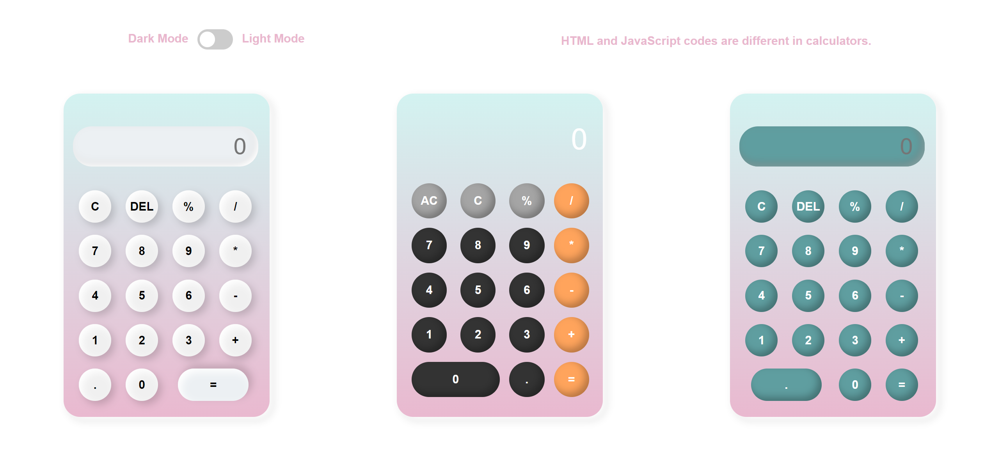

# Calculator 🧮

Welcome to the Calculator repository! This simple yet handy calculator is perfect for quick calculations on the go. Whether you're a student, professional, or just someone who needs to crunch numbers occasionally, this tool has got you covered.

## Features

- Basic arithmetic operations: Addition, subtraction, multiplication, and division.
- Clear button to reset the input.
- Easy to use interface for quick calculations.

## Demo

Check out the live demo [here](https://shakiba-vakili.github.io/calculator/) to see the calculator in action.

## Additional Resources

- **LinkedIn:** Let's connect for collaborations 👥 [Shakiba Sadat Vakili](https://www.linkedin.com/in/shakiba-vakili/)
- **Email:** Reach out to me at 📧 [shakibvakili@gmail.com](mailto:shakibvakili@gmail.com) for any inquiries or collaborations.
- **GitHub:** Visit [@shakiba-vakili](https://github.com/shakiba-vakili) on GitHub for more projects and contributions. 🚀
